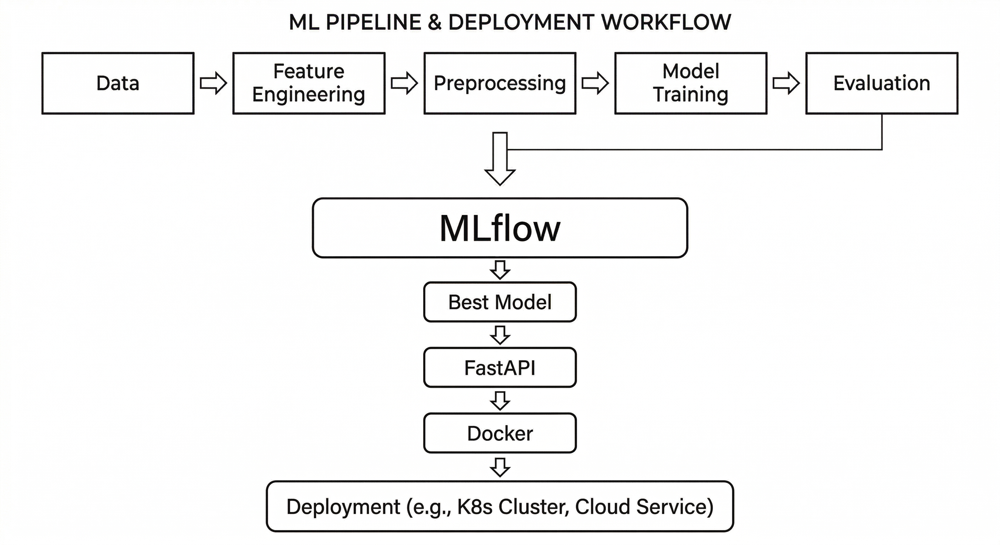
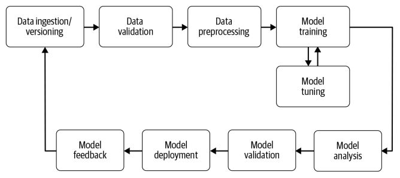

# End-to-End Customer Churn Prediction (MLOps)

## 📌 Project Overview
This project is an **end-to-end MLOps pipeline** for predicting customer churn using Machine Learning.  
It automates data ingestion, feature engineering, model training, evaluation, experiment tracking, and deployment using modern MLOps tools.

The trained model is deployed as a REST API using FastAPI and Docker, while the ML pipeline is orchestrated using Airflow and automated using GitHub Actions (CI/CD).

---

## 📊 Problem Statement
Customer churn is a major problem for telecom and subscription-based companies. Acquiring new customers is more expensive than retaining existing customers.  
This project predicts whether a customer will churn based on their service usage and account information.

**Business Goal:**  
Identify customers likely to churn so the company can take preventive actions such as offers, discounts, or customer support.

## Business Problem

---

## 🏗️ Project Architecture

---

## 🔄 ML Pipeline Flow

---

## 🧰 Tech Stack

| Category | Tools Used |
|---------|------------|
| Programming | Python |
| Machine Learning | Scikit-learn, XGBoost |
| Experiment Tracking | MLflow |
| API | FastAPI |
| Containerization | Docker |
| Workflow Orchestration | Airflow |
| CI/CD | GitHub Actions |
| Configuration | YAML |
| Version Control | GitHub |

---

## ☁️ Cloud Deployment (AWS)

- Docker image is pushed to AWS ECR (Elastic Container Registry)  
- EC2 instance pulls the image from ECR  
- FastAPI application is deployed and served via EC2  

## 📁 Project Structure

'''bash

MLOps-Churn-Pipeline/
│
├── config/
│   └── config.yaml
│
├── src/
│   ├── data_ingestion/
│   ├── feature_engineering/
│   ├── data_preprocessing/
│   ├── model_training/
│   ├── pipeline/
│   ├── logger.py
│   ├── exception.py
│   └── utils.py
│
├── app/
│   └── app.py
│
├── airflow/
│   └── dags/
│       └── churn_pipeline.py
│
├── models/
│
├── images/
│   ├── architecture.png
│   ├── flow.png
│   └── business.png
│
├── Dockerfile
├── requirements.txt
├── requirements-api.txt
├── README.md
└── .github/
└── workflows/
└── mlops.yml
'''

---

## ⚙️ How to Run the Project Locally

### 1️⃣ Create Virtual Environment

python3.10 -m venv venv
source venv/bin/activate

### 2️⃣ Install Dependencies

pip install -r requirements.txt

### 3️⃣ Run Training Pipeline 

python -m src.data_ingestion.data_ingestion
python -m src.feature_engineering.feature_engineering
python -m src.data_preprocessing.data_preprocessing
python -m src.model_training.train
python -m src.model_training.evaluate

### 4️⃣ Run FastAPI

uvicorn app.app:app –reload

Open:

http://127.0.0.1:8000/docs

---

## 🐳 Run Using Docker

### Build Docker Image

docker build -t churn-api .

### Run Docker Container

docker run -p 8000:8000 churn-api

Open:

http://127.0.0.1:8000/docs

---

## ⏰ Run Airflow Pipeline

export AIRFLOW_HOME=~/MLOps-Churn-Pipeline/airflow
airflow standalone

Open Airflow UI:

http://localhost:8080

Trigger DAG:

customer_churn_pipeline

---

## 📈 MLflow Experiment Tracking

Run MLflow:

mlflow ui –port 5001

Open:

http://127.0.0.1:5001

---

## 🤖 Model Output

The model returns:

| Output | Meaning |
|-------|---------|
| Churn_Prediction = 1 | Customer will churn |
| Churn_Prediction = 0 | Customer will not churn |
| Churn_Probability | Probability of churn |

Threshold tuned to **0.40** to improve recall and catch more churn customers.

---

## 🔁 CI/CD Pipeline (GitHub Actions)

This project uses GitHub Actions to:
- Install dependencies
- Perform lint checks
- Build Docker image automatically on every push

---

## 🚀 Future Improvements
- Use AWS S3 for scalable data storage
- Implement model monitoring and logging
- Add data drift detection
- Introduce model registry for versioning

---

## 👨‍💻 Author
**Dhanush Kumar**  
AIML Engineer | Data Science | MLOps

---

## ⭐ Conclusion
This project demonstrates a complete end-to-end MLOps pipeline including:
- Data pipeline orchestration (Airflow)
- Model training and evaluation
- Experiment tracking (MLflow)
- API deployment (FastAPI)
- Containerization (Docker)
- Cloud deployment (AWS EC2 + ECR)
- CI/CD automation (GitHub Actions)