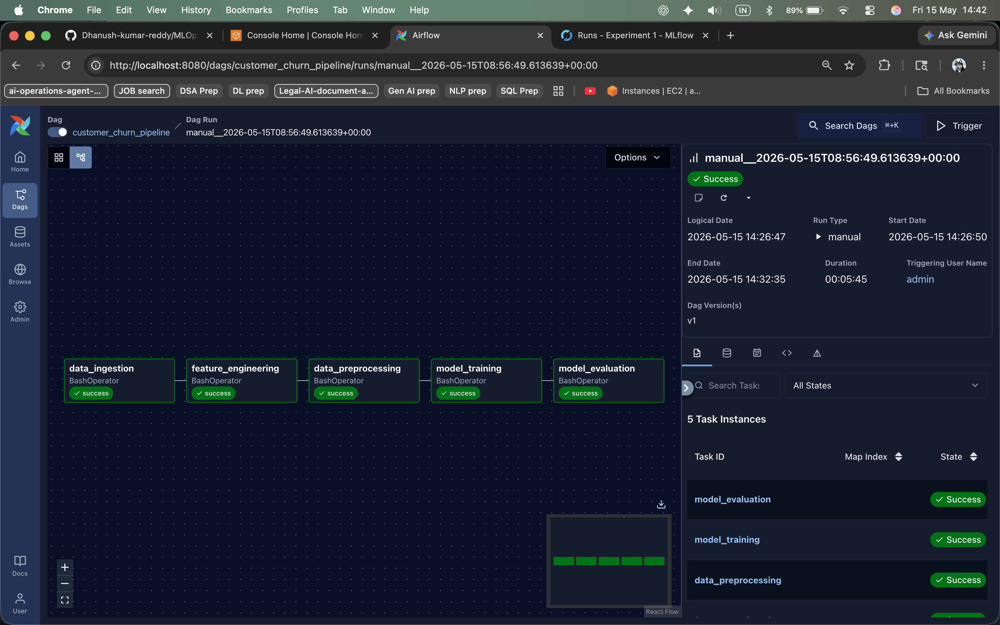
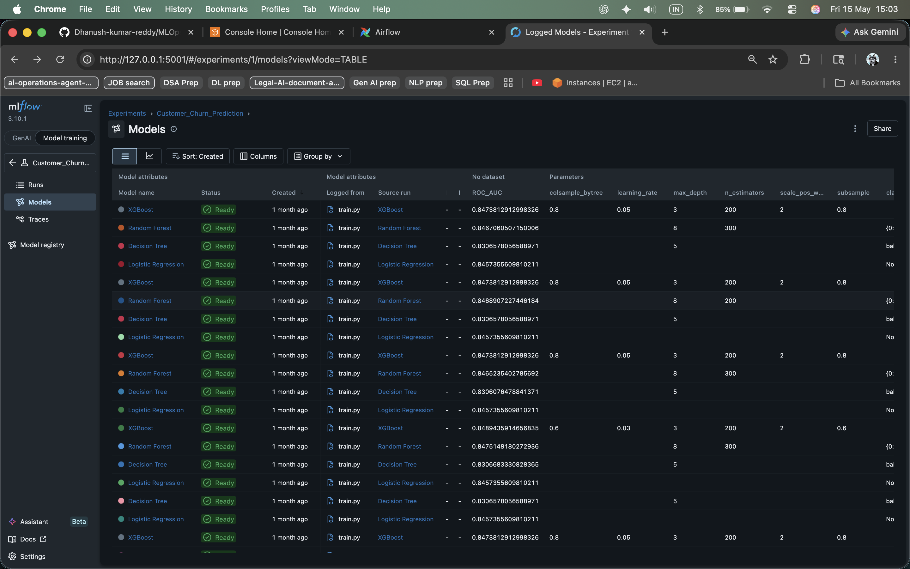
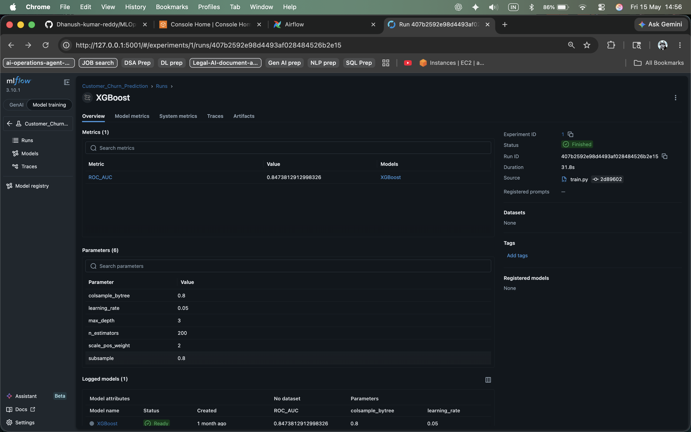

# End-to-End Customer Churn Prediction (MLOps)

## 📌 Project Overview

This project is an end-to-end MLOps pipeline for predicting customer churn using Machine Learning.

The pipeline automates:
- data ingestion
- feature engineering
- data preprocessing
- model training
- model evaluation
- experiment tracking

The project uses:
- Airflow for workflow orchestration
- MLflow for experiment tracking
- FastAPI for serving predictions
- Docker for containerization
- GitHub Actions for CI/CD automation

The trained model is exposed through a REST API using FastAPI.

---

## 📊 Problem Statement

Customer churn is a major problem for telecom and subscription-based companies. Acquiring new customers is more expensive than retaining existing customers.

This project predicts whether a customer will churn based on customer service usage and account-related information.

### Business Goal

Identify customers likely to churn so the business can take preventive actions such as:
- retention campaigns
- offers and discounts
- customer support interventions

---

## 🧠 Business Understanding


---

## 🏗️ CI/CD & Deployment Architecture


---

## 🔄 ML Pipeline Architecture


---

## ⏰ Airflow Pipeline Orchestration



The Airflow DAG orchestrates the complete ML workflow:

1. Data Ingestion  
2. Feature Engineering  
3. Data Preprocessing  
4. Model Training  
5. Model Evaluation  

---

## 📈 MLflow Experiment Tracking

### Experiment Tracking & Model Comparison



MLflow is used to:
- track experiments
- compare multiple models
- store parameters and metrics
- log trained models

Tracked models include:
- Logistic Regression
- Decision Tree
- Random Forest
- XGBoost

---

## 📊 MLflow Run Details



The MLflow run page stores:
- model metrics
- hyperparameters
- run duration
- logged artifacts
- experiment metadata

---

## 🧰 Tech Stack

| Category | Tools Used |
|----------|-------------|
| Programming | Python |
| Machine Learning | Scikit-learn, XGBoost |
| Experiment Tracking | MLflow |
| Workflow Orchestration | Apache Airflow |
| API Framework | FastAPI |
| Containerization | Docker |
| CI/CD | GitHub Actions |
| Configuration | YAML |
| Version Control | GitHub |

---

## ☁️ Deployment Workflow

The CI/CD and deployment workflow includes:

- GitHub Actions pipeline execution
- Docker image build process
- AWS ECR image storage
- EC2-based container deployment
- FastAPI application serving

---

## 📁 Project Structure

```text
MLOps-Churn-Pipeline/
│
├── airflow/
│   └── dags/
│       └── churn_pipeline.py
│
├── app/
│   └── app.py
│
├── config/
│   └── config.yaml
│
├── data/
│
├── images/
│   ├── architecture.png
│   ├── business.png
│   ├── flow.png
│   ├── airflow_pipeline.png
│   ├── mlflow_models.png
│   └── mlflow_run.png
│
├── mlflow/
│
├── models/
│
├── notebooks/
│
├── src/
│   ├── data_ingestion/
│   ├── feature_engineering/
│   ├── data_preprocessing/
│   ├── model_training/
│   ├── exception.py
│   ├── logger.py
│   └── utils.py
│
├── .github/
│   └── workflows/
│       └── mlops.yml
│
├── Dockerfile
├── README.md
├── requirements.txt
├── requirements-api.txt
├── setup.py
└── test_predict.py
```

---

## ⚙️ How to Run the Project Locally

### 1️⃣ Create Virtual Environment

```bash
python3.10 -m venv venv
source venv/bin/activate
```

---

### 2️⃣ Install Dependencies

```bash
pip install -r requirements.txt
```

---

### 3️⃣ Run Training Pipeline

```bash
python -m src.data_ingestion.data_ingestion
python -m src.feature_engineering.feature_engineering
python -m src.data_preprocessing.data_preprocessing
python -m src.model_training.train
python -m src.model_training.evaluate
```

---

### 4️⃣ Run FastAPI Application

```bash
uvicorn app.app:app --reload
```

Open:

```text
http://127.0.0.1:8000/docs
```

---

## 🐳 Run Using Docker

### Build Docker Image

```bash
docker build -t churn-api .
```

### Run Docker Container

```bash
docker run -p 8000:8000 churn-api
```

Open:

```text
http://127.0.0.1:8000/docs
```

---

## ⏰ Run Airflow

```bash
export AIRFLOW_HOME=~/MLOps-Churn-Pipeline/airflow

airflow standalone
```

Open Airflow UI:

```text
http://localhost:8080
```

Trigger DAG:

```text
customer_churn_pipeline
```

---

## 📈 Run MLflow

```bash
mlflow ui --port 5001
```

Open:

```text
http://127.0.0.1:5001
```

---

## 🤖 Model Output

The API returns:

| Output | Meaning |
|--------|----------|
| Churn_Prediction = 1 | Customer likely to churn |
| Churn_Prediction = 0 | Customer likely to stay |
| Churn_Probability | Probability score |

---

## 🔁 CI/CD Pipeline

GitHub Actions is used to:
- install dependencies
- automate Docker builds
- support CI workflow automation

---

## 🚀 Future Improvements

- Add model monitoring
- Add data drift detection
- Use cloud-based storage
- Add automated retraining pipeline
- Implement model registry workflow

---

## 👨‍💻 Author

**Dhanush Kumar**  
AIML Engineer | Data Science | MLOps

---

## ⭐ Conclusion

This project demonstrates:
- end-to-end ML pipeline development
- workflow orchestration using Airflow
- experiment tracking using MLflow
- FastAPI-based model serving
- Docker containerization
- CI/CD workflow automation
- AWS deployment architecture